# [Optional] Visual Guide to Azure VM Deployment

Learn how to create an AlmaLinux Virtual Machine (VM) in Azure as we did in class.

**Type**: Individual

---

## Create

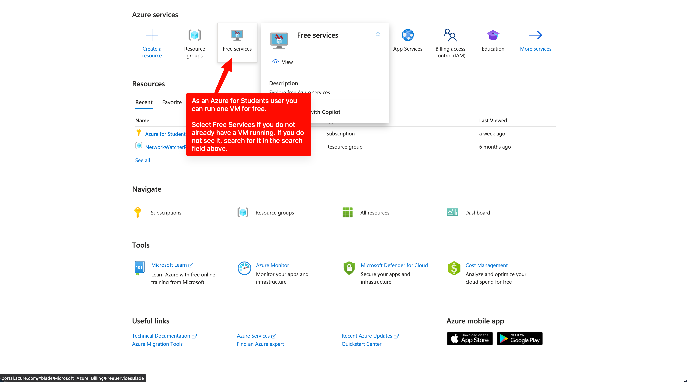

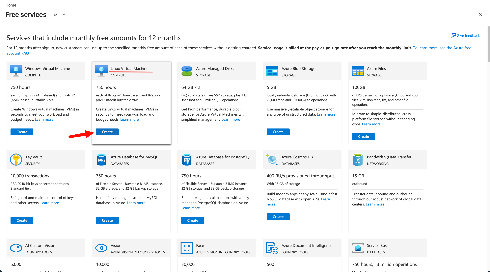

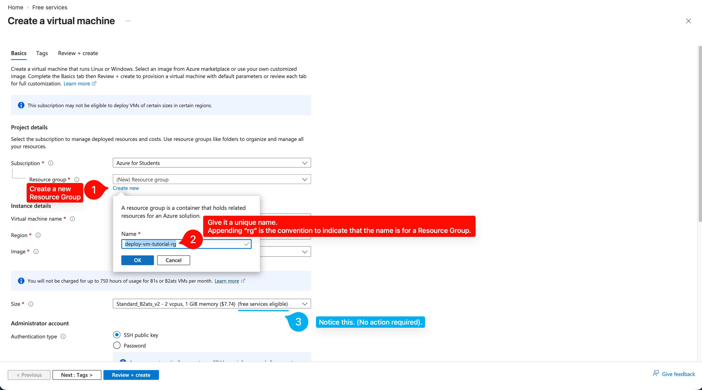

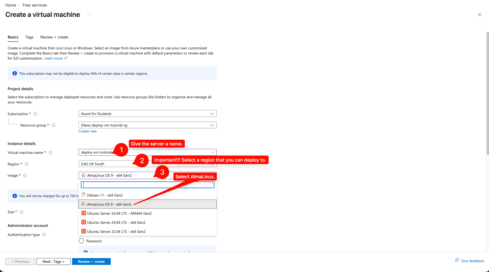

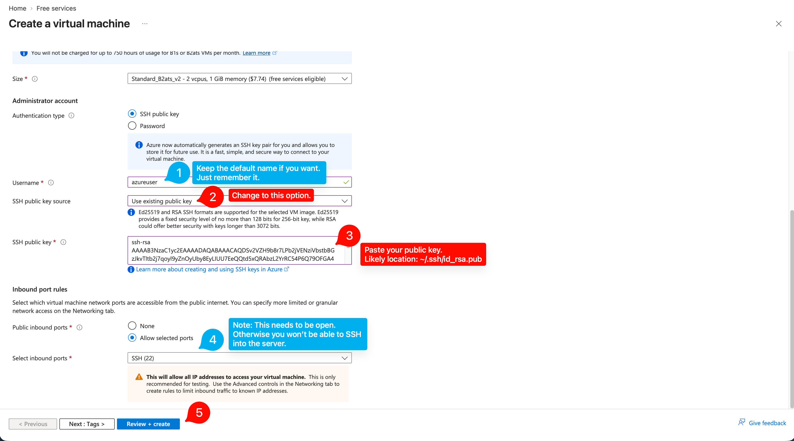

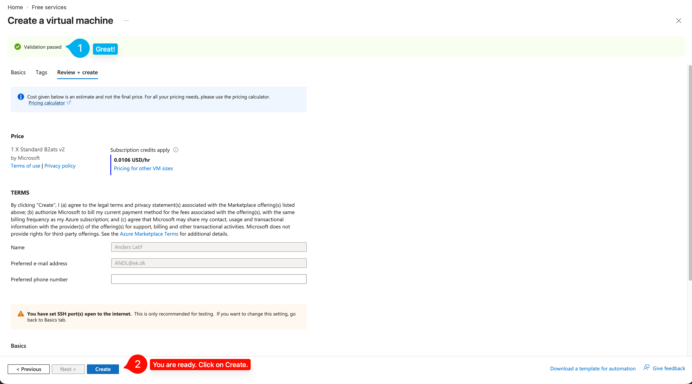

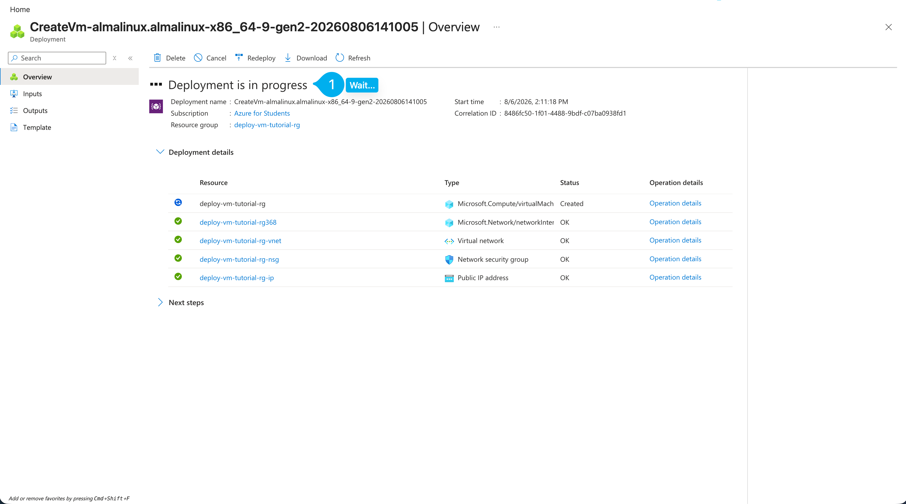

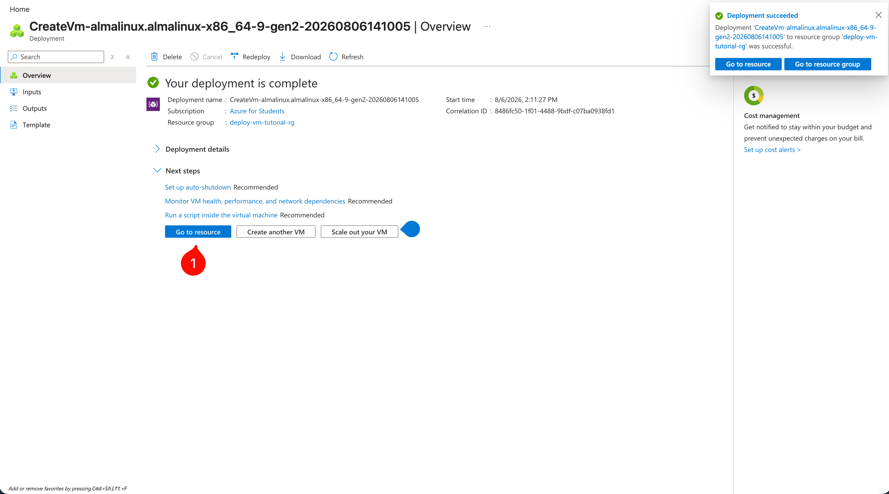

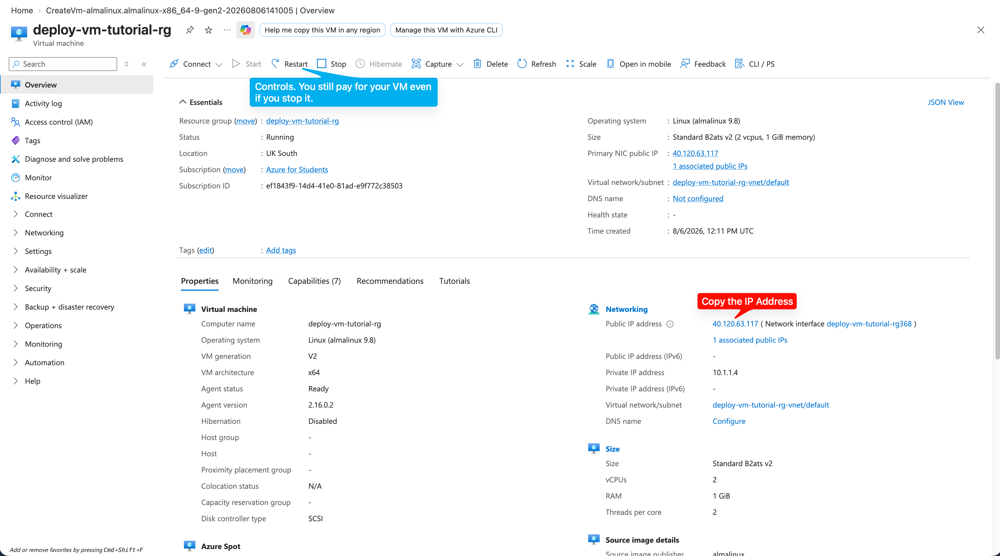

---

## Assigning a public IP Address to the VM

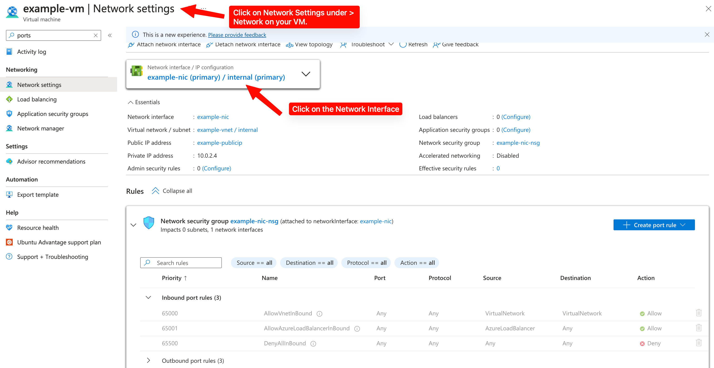

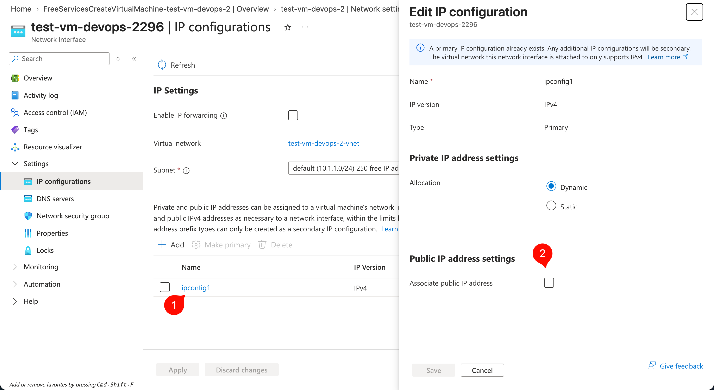

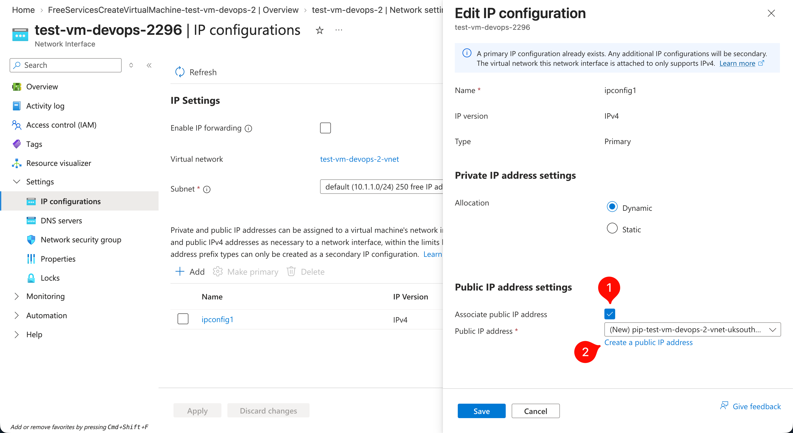

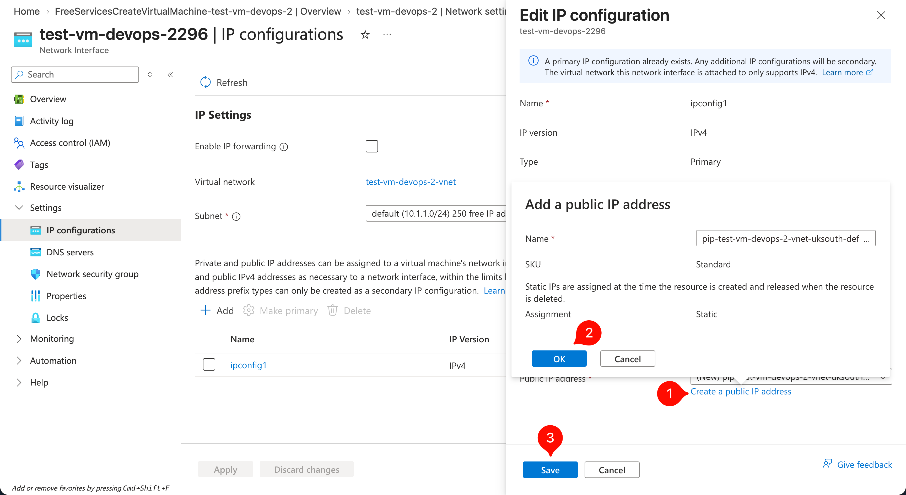

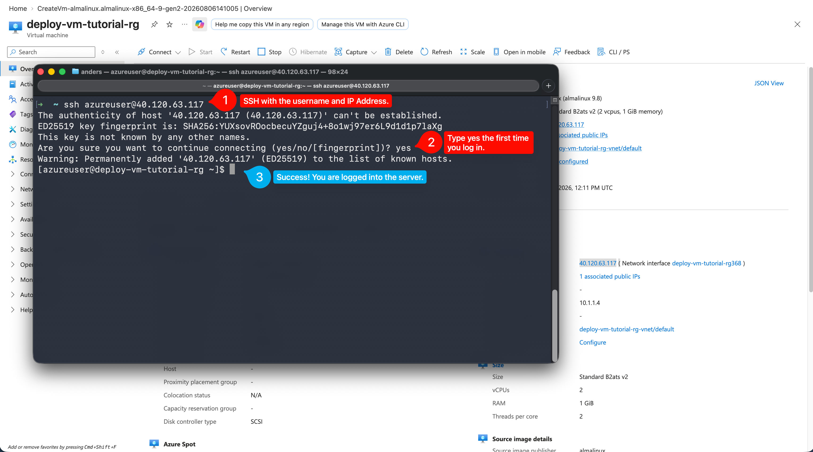

---

## Delete

Once finished, remember to delete the resource group. Azure will still charge for the resources even if you don't use them. Even with a deleted VM, other resources like storage accounts and network interfaces will still be charged. 

**IMPORTANT**: Always delete the resource group if you are done with a VM.

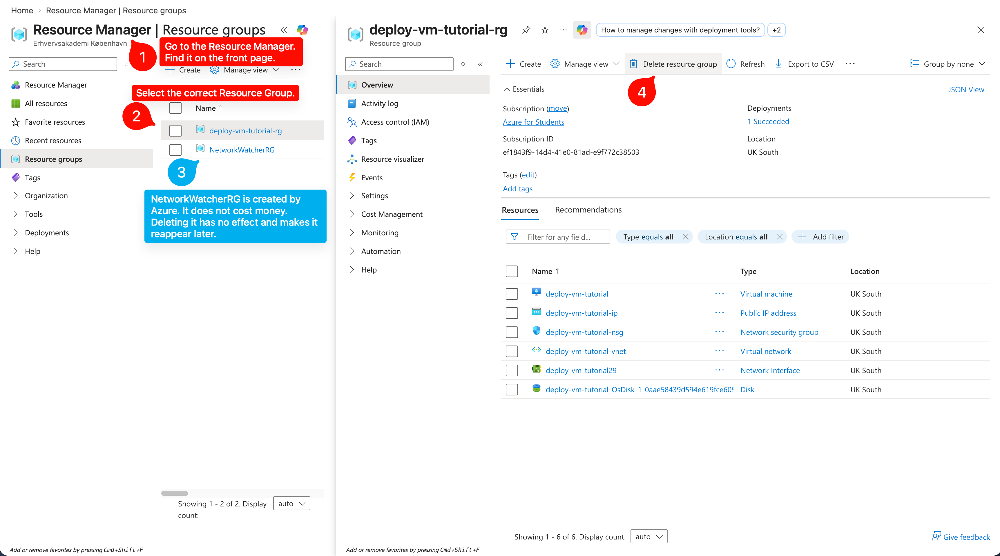

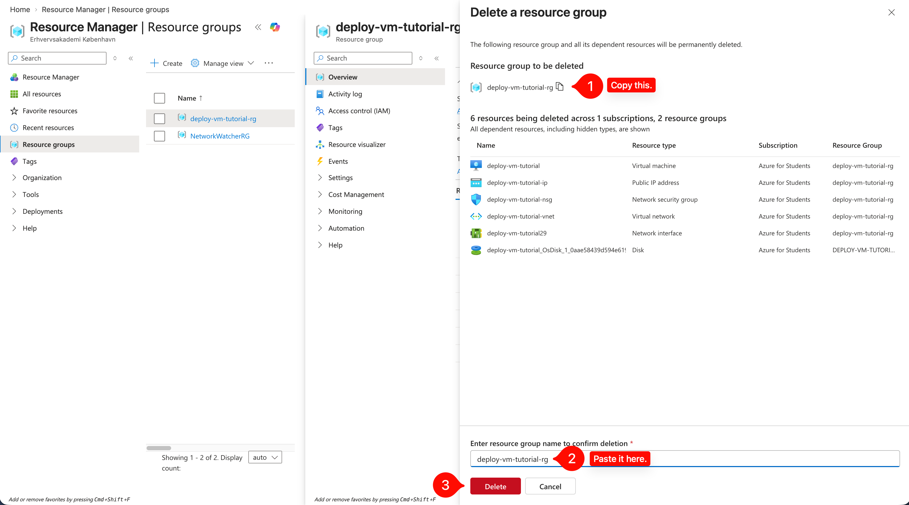

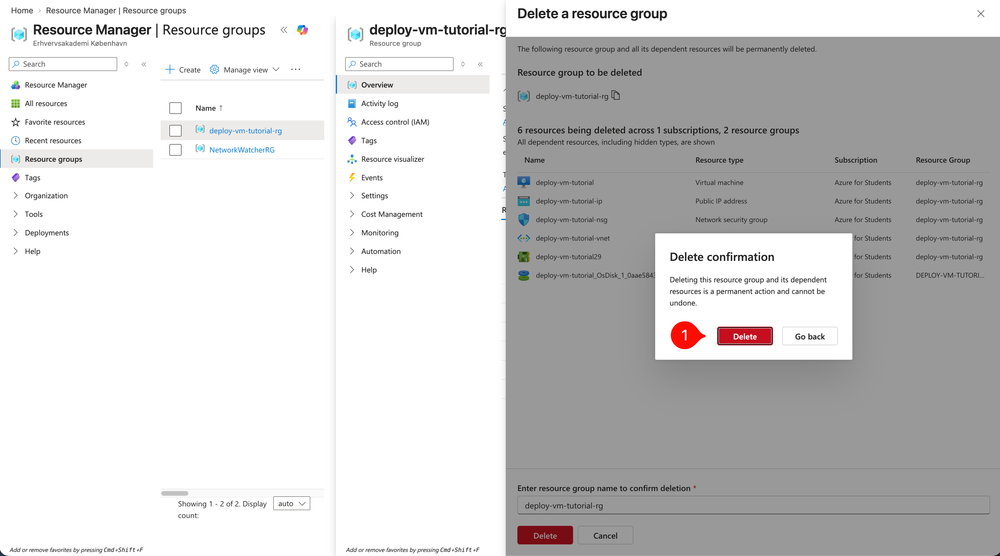

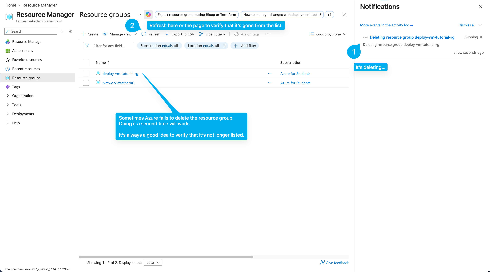