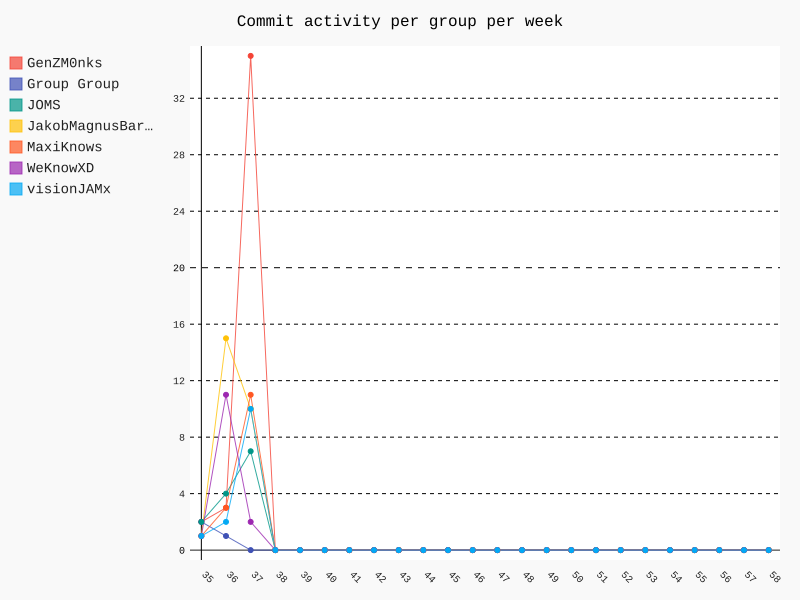
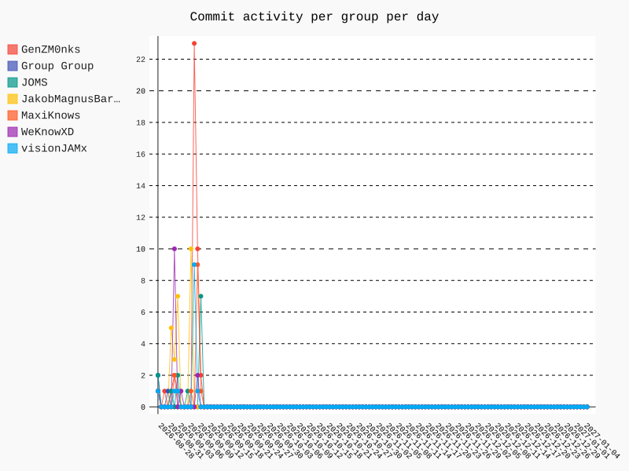

    <h1>Github Actions, Cloud, Azure, Deploy</h1>

---

# Follow the milestones, the content of the lectures

Remember [Gall's law!](https://github.com/who-knows-inc/EK_DAT_DevOps_2026_Autumn/blob/main/00._Course_Material/02._Conventions_OpenAPI_DotEnv/01._Assignments/02._After/commence_the_rewrite.md#galls-law)

Don't push files that shouldn't be pushed.

---

# Weekly commit activity

<iframe src="./assets_introduction/commit_activity_weekly.svg" style="height: 50vh; width: 100%;" frameborder="0"></iframe>

    

---

# Daily commit activity

<iframe src="./assets_introduction/commit_activity_daily.svg" style="height: 50vh; width: 100%;" frameborder="0"></iframe>

    

---

# Weekly DevOps Principle!

**Continuous Delivery**

**Shorten the lead time to value**

Get the product quickly to market. Get feedback from user-behavior. Iterate and improve.

