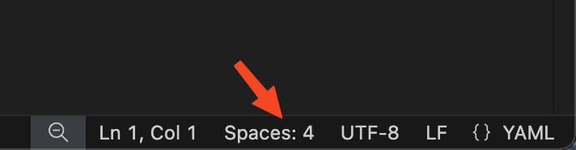
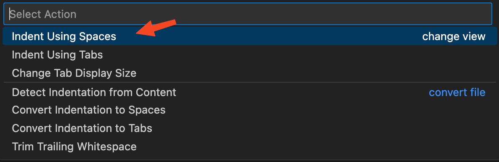
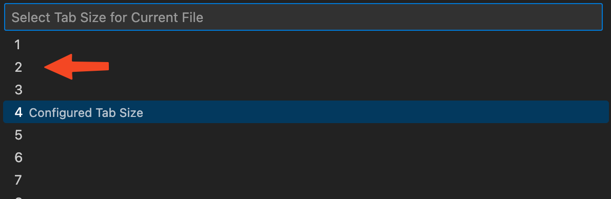
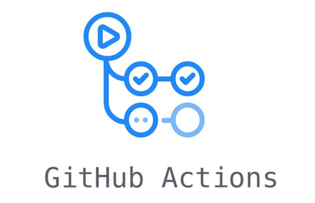
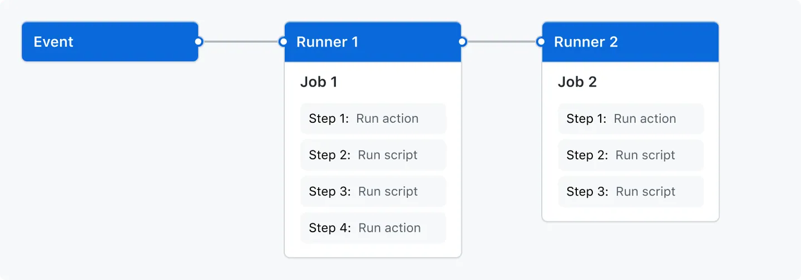
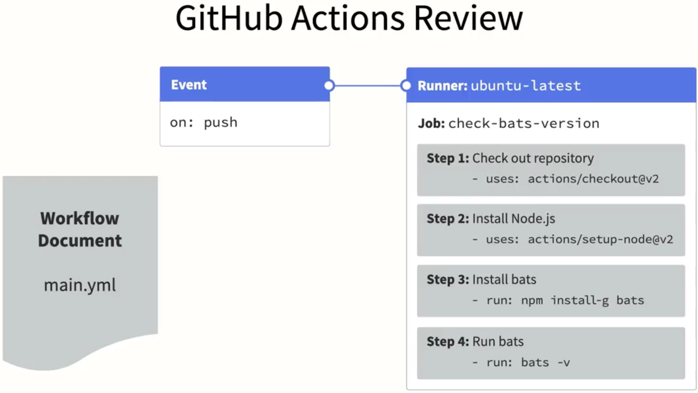
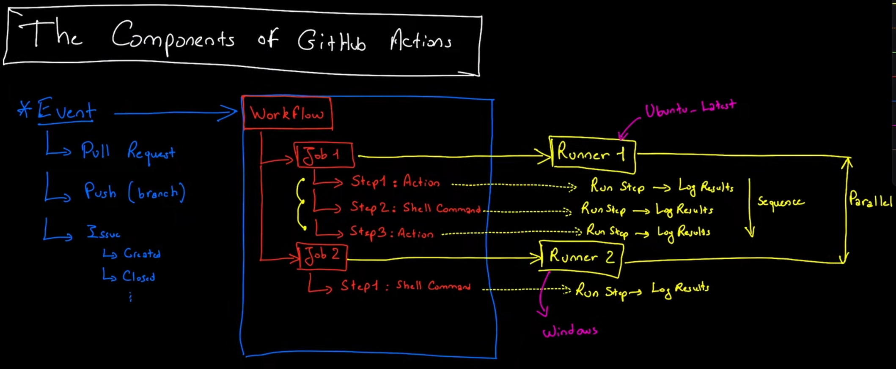

<div class="title-card">
    <h1>GitHub Actions</h1>
</div>

---

# Do you know the difference?

<div style="display: flex; align-items: center;">
    
    
</div>

---

# Let's install GitHub CLI (`gh`)

https://cli.github.com/


This is required only once:

```bash
$ gh auth login
```

Then we can run commands like:

```bash
$ gh repo create
$ gh repo delete
$ gh issue create
$ gh pr create
$ gh workflow run
```

...and many more.


---

<div class="title-card">
    <h1>GitHub Actions</h1>
</div>

---


# How to create a workflow

First let's create a new repository with:

```bash
$ gh repo create
```

Then create any YAML file in the `.github/workflows` directory.

---

# YAML indentation should be 2 spaces

There is a nice GitHub Action extension for VSCode. But it forces YAML files in the workflows folder to have 4 spaces. Here is how to change it:







---

# GitHub Actions

An Action creates an automation based on triggers related to repositories. Run common tasks in repeatable fashion.

Anders' definition: 

> A GitHub Action allows us to borrow a server at GitHub to run some commands for a short while.



---

# Alternatives offered by other Git platforms


- **BitBucket**: Atlassian Bamboo:


- **Gitlab**: Gitlab CI/CD:


---

# Why use GitHub Actions?

* (+) You are already using GitHub

* (+) It’s free with some limitations (but the alternatives have similar limitations  )

https://docs.github.com/en/billing/managing-billing-for-github-actions/about-billing-for-github-actions#included-storage-and-minutes

* (-) The free version is slow


---

# GitHub Actions (terminology) - I

**Event**: Triggers that start a workflow

**Workflows**: Defines an automation from start to finish

**Jobs**: A workflow contains one or more jobs. A job is one or more steps.

**Steps**: Simple commands, shell scripts or actions. Steps do not run in parallel per default. Runs in sequence from top to bottom. [Can now be made to run in parallel](https://github.blog/changelog/2026-06-25-actions-steps-can-now-be-run-in-parallel/).


---

# GitHub Actions (terminology) - II

**Runner**: Compute layer where jobs are executed. Each job has its own runner.

Runners can run in parallel.

GitHub provides 3 types of runners: Ubuntu, Windows and MacOS.

Using a self-hosted runner is also possible.

GitHub runners comes with pre-installed tools, runtimes and compilers.

---

# Single Workflow - Overview I



---

# Overview II



---

# Overview from the video



---


# Technical requirements:

Workflows must be stored in the `.github/workflows` folder.

Workflows are defined with YAML.

Workflows must define:

* Trigger (on)
* At least one job with a runner (runs-on)
* Steps


---

# The checkout action (actions/checkout@v3)

Allows one to clone the repository code to the runner. 

Made by GitHub: https://github.com/actions/checkout

The following can be specified: 

`@<tag>`, `@<branch>`, `@<commit_sha>`

---

# Hello World workflow

Let's manually create a workflow that echoes (logs) "Hello World" on every push and PR.

1. Create a new repository. 

2. Create `.github/workflows`

3. In it, create a file called `hello_world.yaml`

---

# In hello_world.yaml 


```yaml
name: Hello world workflow

on:
  push:
    branches: [main]
  pull_request:
    branches: [main]

jobs:
  hello:
    runs-on: ubuntu-latest
    steps:
      - uses: actions/checkout@v3
      - name: Run hello world
        run: echo "Hello world"
        shell: bash
```
*Study the snippet. Can you spot the uneccessary part?*


