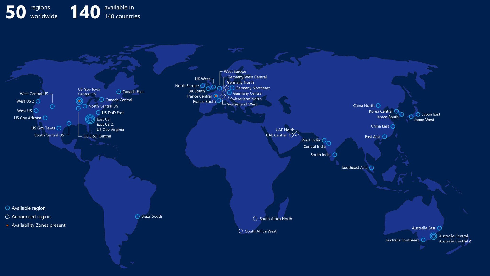
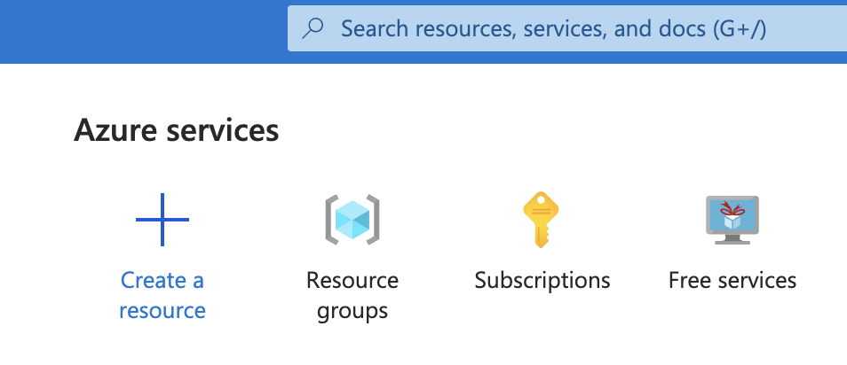
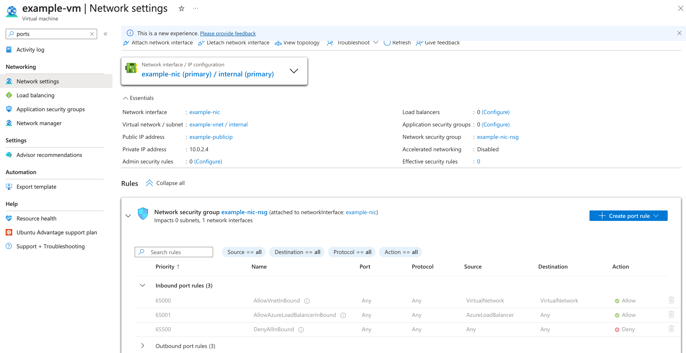

<div class="title-card">
    <h1>Azure</h1>
</div>

---

# Azure data centers

<div>
    
</div>


---

# Cost management - Resource Groups I


Please beware that even if no services are running, if a resource group exists it can still use a lot of money. Delete resource groups when not in use. 

Exception: Network Watcher:

https://learn.microsoft.com/en-us/azure/network-watcher/network-watcher-overview

---

# Cost management

Recommendation: When possible use free services. 

<div>
    
</div>

I have provided a guide with the course material on how to setup limitations on Pay-As-You-Go accounts (not Azure for students).

---

<div class="title-card">
    <h1>Virtual Machines</h1>
</div>

---

# Virtual machines 

Virtual machine is the generic term for servers in the cloud.

In AWS they are called **EC2**. In Azure, **Azure Virtual Machines**.

Let's manually create a virtual machine (through Azure Free Services). 

But first, let's generate an SSH key locally which we will use to login.

---

# Generating a SSH-key

For simplicity, we will use RSA keys in this course.

Generate a 4096-bit RSA SSH-key pair if you don't have one. 

*nix (tldr ssh-keygen):

```bash
$ ssh-keygen -t rsa -b 4096
```

Windows (2048-bit RSA key is the default): 

```powershell
$ ssh-keygen -m PEM -t rsa -b 4096
```

Just press enter 3 times and go with the defaults. No need to enter a passphrase.

https://learn.microsoft.com/en-us/azure/virtual-machines/linux/create-ssh-keys-detailed

In case of permission issues for *nix users:

```bash
$ chmod 600 /path/to/your/key
```

---

# Manual Creation vs. Scripts

Because of problems with the `@ek.dk` setup we will create VMs via scripts instead of the Azure Portal (UI).

This repository containing the necessary scripts can be found here: https://github.com/anderslatif/EK_Azure

It also contains a guide on how to look up [available regions specific to your account through the portal](https://github.com/anderslatif/EK_Azure/blob/main/tutorials/available_regions/azure_available_regions.md).

[The script](https://github.com/anderslatif/EK_Azure?tab=readme-ov-file#vms) in the above repository does that programmatically by creating resource groups in all regions to verify availability. It takes a while to run but only needs to be done once. 

Clone the repository and run the scripts. If you experience problems, then try deleting the config files that are created and start over. 


---

# Let's create a virtual machine

In the UI choose from Free services.

Various OS to choose from. We will use the latest version of AlmaLinux.

Deploying Ubuntu image has been causing problems and [AlmaLinux is endorsed by Microsoft](https://learn.microsoft.com/en-us/azure/virtual-machines/linux/endorsed-distros#platform-image-partners).

AlmaLinux is based on Red Hat Enterprise Linux (RHEL) which means that it uses `dnf` as a package manager. 

---

# The `dnf` package manager

To update:

```bash
$ sudo dnf update -y
```

If you need to install a package later on:

```bash
$ sudo dnf install <package_name>
```

---

# Installing Docker on AlmaLinux

Paste this into AlmaLinux:

```bash
sudo dnf -y install dnf-plugins-core
sudo dnf config-manager --add-repo https://download.docker.com/linux/centos/docker-ce.repo
sudo dnf  -y install docker-ce docker-ce-cli containerd.io docker-buildx-plugin docker-compose-plugin
sudo systemctl enable --now docker
sudo usermod -aG docker $USER
```

Besides the commands mentioned in the [Docker Documentation](https://docs.docker.com/engine/install/centos/#install-using-the-repository). The above adds the current user to the Docker group so that they don't have to use sudo when invoking Docker commands. 

Test it out with:

```bash
$ docker run hello-world
```

---

# Making Nginx serve some HTML on port 80

Run the following:

```bash
$ docker run -d --name nginx -p 80:80 nginx
```

This starts Nginx that serves a default HTML page.

We wan't to allow access from port `80`.

---

# Network management: Ports I

There are two type of rules:

1. Inbound: Traffic going **TO** the VM.

2. Outbund: Traffic going **OUT** from the VM. 

Define an inbound rule to whitelist the port that the application is running on so we can access it from the internet.

---
 
# Network management: Ports II




---

# Create a static IP address

https://learn.microsoft.com/en-us/azure/virtual-network/ip-services/virtual-networks-static-private-ip-arm-pportal

---

# Let's tear it down!

Delete it and **REMEMBER** to also delete the resource group!

**Repetition**: In Azure, a resource group will still cost money, even if the VM has been deleted. 


