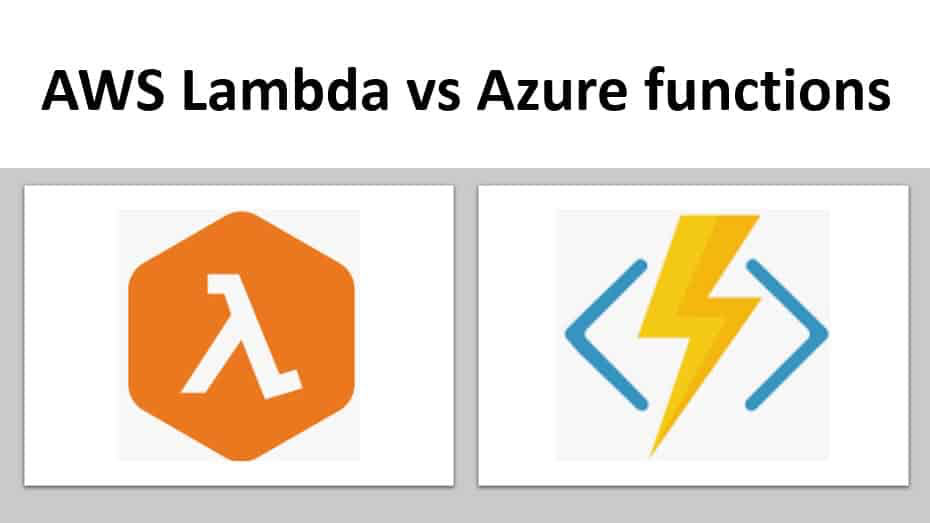
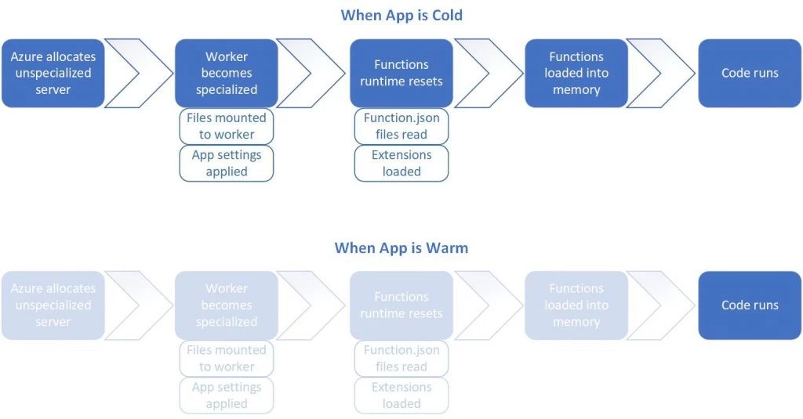
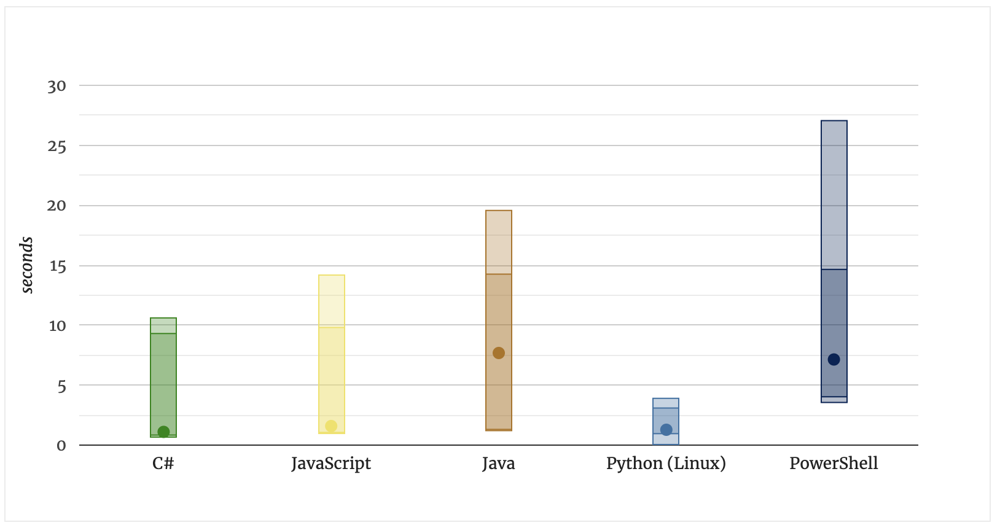

    <h1>More Cloud - Other cloud services and cloud providers</h1>

---

# Serverless computing

---

# Why serverless?

Saves time. Easier to deploy.

Scalable. 

Saves money. (Azure Functions Different pricing plans.)

---

# Azure Functions - subscription models

* **Consumption plan**: Pay for the time that your code runs.

* **Premium plan**: You specify a number of pre-warmed instances that are always online. 

* **App service plan**: Run as if they are web apps. Not serverless.

---

# Cold starts - A problem

Cold start: The time it takes to allocate the function to a server and setup the runtime environment before your code can run.

Functions are held warm for roughly 20 minutes according to below source.

(Source: https://azure.microsoft.com/en-us/blog/understanding-serverless-cold-start/)

---

# More cold start metrics

(Source: https://mikhail.io/serverless/coldstarts/azure/)

---

# Triggers and bindings

https://learn.microsoft.com/en-us/azure/azure-functions/functions-triggers-bindings?tabs=isolated-process%2Cpython-v2&pivots=programming-language-csharp#supported-bindings

---

# Azure Key Vault

A way to store values outside of the code such as environment variables. 

Can be used to authenticate services. 
Also useful for authorization. Access policies can limit usage.

Example use case:
Define the database connection string here. Functions can then get the connection string from the Key Vault. Now it’s removed from the code and can be changed in one place.

